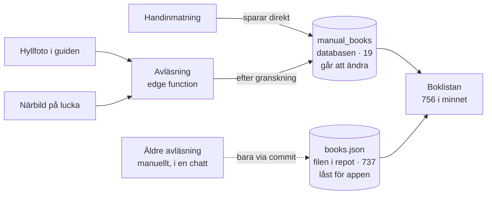

# Bokhyllans karta

*Genomgång 27 augusti 2026. Var böckerna faktiskt bor, hur ett foto blir en
katalogpost, och de nio ställen där systemet tappar sammanhanget.*

756 böcker · 9 tabeller · 37 hyllfoton · 51 luckor · 1 edge function

---

## Tre lager, två sanningar

Appen är en statisk sida utan byggkedja — `index.html`, `js/app.js`,
`css/style.css` och några JSON-filer. Supabase sköter allt som användaren
ändrar. Det som gör systemet svårare att resonera om än det ser ut är att
**böcker kommer från två håll som aldrig möts**.

| Lager | Innehåll | Ändras av |
|---|---|---|
| **Statiska filer** (`data/*.json`) | 737 böcker, 490 beskrivningar, 37 hyllfoton, 51 luckor, 31 säljkandidater | Bara en commit till repot |
| **Databasen** (Supabase) | 19 böcker, status, hyllnamn, luckstatus, hyllfoton i kö, kategorinamn, omslag | Appen, när du är inloggad |
| **Avläsningen** (edge function) | Läser ett foto, föreslår böcker | Deployas separat, utanför repots flöde |

Vid start slås lagren ihop i minnet: de 737 laddas ur filen, de 19 hämtas ur
databasen och läggs till med id från en miljon och uppåt. Därefter är de
likvärdiga i gränssnittet — men bara det ena lagret går att ändra från appen.

**De två lagren möts först i webbläsaren.** Allt nytt hamnar i databasen, medan
de 737 ursprungliga böckerna sitter i en fil som appen inte kan skriva till.
Därför går en gammal bok inte att flytta, döpa om eller ta bort från appen —
bara en ny kan det.

---

## Vägen från foto till bok

Det här är flödet vi byggt de senaste dagarna, och det enda som faktiskt fyller
katalogen automatiskt.

1. **Du fotar.** Guiden laddar upp bilden till lagringen och sparar samtidigt en
   nedskalad kopia i databasraden. Det är kopian avläsningen läser — lagringen
   når den inte.
2. **Du trycker Analysera.** Appen skickar radens id och listan över kategorier
   du redan använder, tillsammans med din inloggning.
3. **Funktionen kontrollerar att du är inloggad.** Den skriver förbi databasens
   egna spärrar, så den måste själv avvisa alla utan giltig session.
   Anon-nyckeln ligger i klartext i det publika repot och stoppas här.
4. **Claude läser ryggarna** och svarar med en rad per bok: titel, författare,
   kategori ur din lista, beskrivning, och en markering för det den var osäker
   på. Roterade foton hanteras genom att textens riktning avgör vad som är upp.
5. **Du granskar.** Raderna visas redigerbara, med föreslagen hyllkod. Inget är
   sparat än.
6. **Du sparar.** Böckerna blir rader i databasen och dyker upp i boklistan.
7. **Du klarmarkerar hyllan.** Först nu försvinner den ur kön. Avläsningen gör
   det aldrig åt dig — det var ett medvetet val efter att den första versionen
   gömde undan hyllan innan du hunnit titta.

> **Hyllkoden** gissas ur etiketten du skrev i guiden: `Plan 3` blir `10:S3`,
> `Vänster plan 3` blir `1:V3`. En etikett som inte beskriver ett hyllplan —
> `Skrivbord`, `Fönsterbrädan` — blir en lös plats med koden `10:L1` och ett
> eget namn, så att den kan heta det den heter. Koden går alltid att rätta
> innan du sparar.

---

## Övriga flöden

| Flöde | Vad det gör | Var det bor | Läge |
|---|---|---|---|
| **Sök och bläddra** | Fritext, filter på plats och kategori, klick på en bok ger beskrivning och länkar till Goodreads och Adlibris | Söksidan | Fungerar |
| **Status** | Klick växlar mellan på plats, utlånad och flyter runt. Delas med familjen i realtid. | Söksidan | Fungerar |
| **Hyllvyn** | Foto i stort format med böckerna som hör till platsen listade under | Söksidan | Ur takt |
| **Luckor** | 51 partier som inte gick att läsa. Fota om, skriv in böcker för hand, eller läs av. | Inställningar | Halvt |
| **Ny hylla** | Guide som lägger till en plats och skickar in ett foto per hyllplan | Inställningar | Fungerar |
| **Uppdatera hylla** | Nytt foto av en hylla som ändrats. Fotot hamnar i kön — men bilden i hyllvyn byts aldrig, och böckerna jämförs inte. | Inställningar | **Slutar halvvägs** |
| **Kategorier** | Döp om en kategori, eller flytta en bok till en annan | Inställningar | Fungerar |
| **Sälj** | 31 kandidater med prisuppskattning mot Studentapan och länk vidare | Egen flik | Manuell |
| **Dela** | Textsammanfattning av hyllan att skicka vidare | Toppfältet | Fungerar |

---

## De nio glappen

Ordnade efter hur mycket de kommer att kosta dig om de får ligga kvar. De fem
första är sådana vi sprang på 27 augusti.

### 1. Katalogen har två sanningar — *grundorsak*

De 737 ursprungliga böckerna sitter i en fil som bara kan ändras genom en
commit. De 19 nya finns i databasen. Att flytta en gammal bok, rätta en titel
eller ta bort en dubblett går inte från appen — och de flesta böcker är gamla.

**Åtgärd:** flytta hela `books.json` in i databasen en gång, och låt filen bli
en ren startdump. Allt nedan blir enklare efteråt.

### 2. Utloggad ser en halv katalog, utan att märka det — *förvirrar*

Databasens spärrar släpper bara in inloggade även för *läsning*, tvärtemot vad
överlämningen påstår. En utloggad besökare — du själv efter en utgången session
— ser 737 böcker, inga hyllnamn, inga statusar, och inte ett felmeddelande.

**Åtgärd:** öppna läsning för alla, eller visa tydligt i gränssnittet när något
inte kunde laddas. Notera att öppen läsning gör hyllornas innehåll läsbart för
den som har länken.

### 3. Inget skydd mot dubbletter — *skapar städarbete*

Tabellen har ingen unik regel, och granskningslistan jämför inte mot böcker som
redan finns. Fotar du om en hylla som redan är katalogiserad och sparar, får du
varenda bok två gånger.

**Åtgärd:** markera rader som redan finns i katalogen och låt dem vara förvalt
bortvalda i granskningen.

### 4. En plats kan bara ha ett innehåll, fast den har flera högar

Sovrummet vid sängen har tre högar men en enda kod, `5:S1`, och ett enda foto.
Alla tio böcker ligger på samma kod medan bilden visar fyra av dem. Det ser ut
som ett fel i appen men är en modellfråga: platsen behöver `5:S1` till `5:S3`.

**Åtgärd:** fota de två andra högarna med koderna angivna, och flytta de sex
böckerna till rätt kod.

### 5. Uppdatering av en hylla slutar halvvägs — *halvbyggt flöde*

Guiden har alternativet "nytt foto av en hylla som finns", och det fungerar så
långt att fotot hamnar i kön med rätt hyllkod. Men där tar flödet slut: **den
gamla bilden byts aldrig ut i hyllvyn**, eftersom bilderna ligger i en fil i
repot och kön ligger i databasen. Och ingenting jämför vad kameran ser med vad
katalogen tror står där. Varje omfotografering ökar alltså avståndet mellan
bild och verklighet i stället för att minska det.

**Åtgärd:** två delar. Låt hyllvyn visa det senaste fotot ur databasen när ett
sådant finns, i stället för filen. Och låt avläsningen svara med tre listor —
nya, försvunna, oförändrade — i stället för en. Det stod redan på önskelistan
som "automatisk diff", och går att bygga nu när avläsningen ger strukturerade
rader.

### 6. Luckor utan eget foto kan inte läsas av — *begränsning*

De 51 luckorna har en beskuren miniatyr ur det stora hyllfotot, men den ligger i
repot och inte i databasen — och avläsningen når bara databasen. Därför saknar
de flesta luckor knappen tills du fotat om dem. Miniatyrerna är dessutom för
suddiga för att läsa ryggarna, så en närbild behövs ändå.

**Åtgärd:** ingen kod behövs — men texten i kortet bör säga varför knappen
saknas.

### 7. Böcker identifieras med sin titel — *tickar*

Beskrivningarna slås upp på titelsträngen. Två böcker med samma titel delar
beskrivning, och en rättad titel tappar sin. Samma svaghet finns i katalogen på
flera ställen: inget stabilt id per bok.

**Åtgärd:** följer naturligt med om böckerna flyttas till databasen, där varje
rad redan har ett id.

### 8. De 490 beskrivningarna är overifierade — *känt sedan tidigare*

De är skrivna ur bokkunskap, inte hämtade från någon källa, och kan innehålla
fel. Nya beskrivningar från avläsningen ärver samma svaghet. Databasen märker
numera varje bok med varifrån den kom (`source`, `uncertain`), men gränssnittet
visar det inte.

**Åtgärd:** visa ursprunget i informationsrutan, så att en overifierad
beskrivning ser overifierad ut.

### 9. Avläsningen och appen kan hamna i otakt — *processfråga*

Funktionen deployas direkt till Supabase medan appen publiceras via en merge.
Ändras båda samtidigt kan det nya svarsformatet nå en app som inte förstår det
— det hände 27 augusti, och gav en textklump där en boklista skulle stått.

**Åtgärd:** deploya funktionen först när appen är mergad, eller låt funktionen
svara med båda formaten under övergången.

---

## Vad jag skulle göra härnäst

I den här ordningen, för att varje steg gör nästa billigare:

- **Dubblettvarningen först.** Liten, och gör allt fotande härifrån och framåt
  riskfritt.
- **Läsrättigheterna.** En rad SQL, och tar bort en hel klass av förvirrande
  fel.
- **Böckerna in i databasen.** Störst arbete, men löser tre glapp på en gång —
  redigerbarhet, stabila id, och en enda sanning.
- **Diffen vid omfotografering.** Nu går den att bygga, eftersom avläsningen
  redan svarar med strukturerade rader.
- **Sängen och Arbetsrummet.** Fota klart, läs av, spara. Det är då katalogen
  faktiskt växer.

---

*Sammanställd ur koden i `tringenr/bokhyllan` och databasen
`zuesxdqifsnvhleiukum`, 27 augusti 2026. Siffrorna är avlästa ur källorna samma
dag och rör sig när du fortsätter fylla på.*
